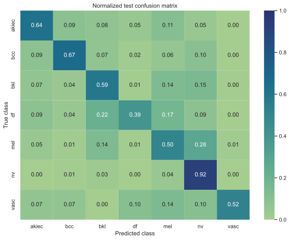
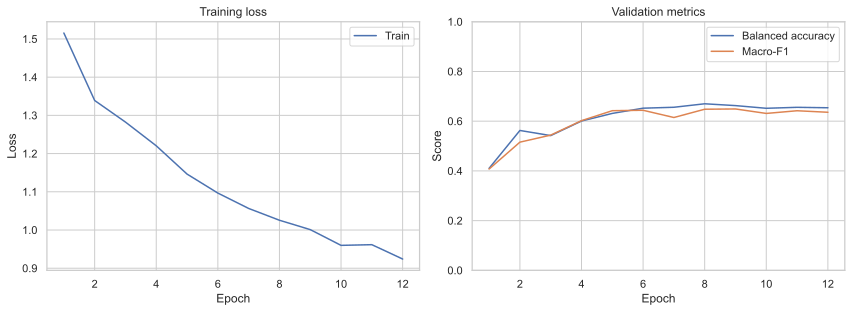

# Dermalens HAM10000 MobileNetV3 model card

## Model summary

Dermalens uses a MobileNetV3-Small image classifier fine-tuned on the seven
diagnostic categories in HAM10000. The model accepts a centered 224 x 224 RGB
crop and returns calibrated dataset-class probabilities. A validation-derived
confidence threshold lets the application abstain when confidence is low.

This is a non-commercial machine-learning research demonstration. It is not a
medical device and must not be used for diagnosis, screening, triage, treatment,
or decisions about seeking care.

| Property | Value |
| --- | --- |
| Version | `ham10000-mnv3-v1` |
| Architecture | MobileNetV3-Small |
| Initialization | TorchVision ImageNet-1K weights |
| Parameters | 1,525,031 |
| Artifact | ONNX, 6,109,747 bytes |
| SHA-256 | `0684299f03b0ceadf4f087a6f1929ad09b1d261a6e4010fdeca48f3c9e6bfb67` |
| Runtime | ONNX Runtime, CPU execution provider |
| Output | Seven calibrated closed-set probabilities |

## Intended use

The model is intended to demonstrate:

- reproducible transfer learning on an imbalanced image dataset;
- lesion-grouped validation and test partitions;
- calibration and confidence-aware abstention;
- checksummed deployment with PyTorch-to-ONNX parity verification; and
- responsible presentation of medical-imaging research.

It is designed only for retrospective dermoscopic images resembling the
training distribution. Phone photographs, clinical close-ups, non-dermoscopic
images, and unidentified skin conditions are outside its scope.

## Training data

[HAM10000](https://doi.org/10.7910/DVN/DBW86T) contains 10,015 dermoscopic
images representing 7,470 unique lesions. The accompanying
[data descriptor](https://doi.org/10.1038/sdata.2018.161) documents collection
and diagnostic confirmation. Dataset access and class metadata were reconciled
against the official ISIC collection before training.

| Split | Images | Unique lesions |
| --- | ---: | ---: |
| Train | 6,409 | 4,780 |
| Validation | 1,602 | 1,195 |
| Test | 2,004 | 1,495 |

Partitions were produced with `StratifiedGroupKFold`. Grouping by `lesion_id`
prevents different images of the same lesion from crossing split boundaries.
The exact image-ID hashes and class counts are published in
[`models/metrics.json`](models/metrics.json).

HAM10000 is licensed
[CC BY-NC 4.0](https://creativecommons.org/licenses/by-nc/4.0/). The derived
model artifact is distributed under the same non-commercial terms.

## Training procedure

- Resize/crop and ImageNet normalization for evaluation
- Random resized crops, flips, rotation, and color jitter for training
- Class-weighted cross-entropy using inverse-square-root frequency weights
- Label smoothing of `0.05`
- Three classifier-head epochs followed by full-network fine-tuning
- AdamW optimization with cosine learning-rate schedules
- Early stopping after four validation epochs without improvement
- Checkpoint selection by validation balanced accuracy, then macro-F1
- Temperature scaling and confidence-threshold selection on validation only

The test partition was not used for checkpoint selection, calibration, or
confidence-threshold selection.

## Held-out test results

| Metric | Result |
| --- | ---: |
| Accuracy | 80.04% |
| Balanced accuracy | 60.31% |
| Macro-F1 | 60.26% |
| Weighted-F1 | 80.07% |
| Log loss | 0.5962 |
| Expected calibration error | 3.43% |

Balanced accuracy and macro-F1 are primary reporting metrics because the
dataset is strongly imbalanced.

### Per-class results

| Code | Class | Precision | Recall | F1 | Support |
| --- | --- | ---: | ---: | ---: | ---: |
| `akiec` | Actinic keratoses / intraepithelial carcinoma | 49.41% | 63.64% | 55.63% | 66 |
| `bcc` | Basal cell carcinoma | 71.13% | 66.99% | 69.00% | 103 |
| `bkl` | Benign keratosis-like lesions | 61.61% | 59.09% | 60.32% | 220 |
| `df` | Dermatofibroma | 36.00% | 39.13% | 37.50% | 23 |
| `mel` | Melanoma | 50.23% | 50.00% | 50.11% | 222 |
| `nv` | Melanocytic nevi | 91.51% | 91.57% | 91.54% | 1,341 |
| `vasc` | Vascular lesions | 65.22% | 51.72% | 57.69% | 29 |

### Calibration and abstention

Temperature scaling selected a temperature of `0.685` from validation logits.
The validation-derived confidence threshold is `0.35`.

| Selective metric | Validation | Test |
| --- | ---: | ---: |
| Coverage | 98.75% | 98.60% |
| Accuracy on accepted predictions | 79.33% | 80.92% |

The confidence threshold is a product-safety affordance, not a clinical safety
guarantee. Confidence does not indicate medical certainty.

## Technical validation

- The ONNX export was compared against CPU PyTorch on the same inputs.
- Maximum absolute logit difference: `0.000013113`.
- The runtime recalculates and verifies the artifact SHA-256 before loading.
- Uploaded images are decoded and processed in memory and are not persisted.
- Inference runs only after resolution, exposure, contrast, and edge-detail
  quality checks pass.

## Limitations

- Evaluation is internal and retrospective; there is no external or prospective
  clinical validation.
- HAM10000 images differ from typical phone and general clinical photographs.
- The seven-class closed taxonomy omits many skin conditions and cannot
  identify an unknown condition.
- The dataset is imbalanced; rare-class estimates have small support and wide
  uncertainty.
- Results may not generalize across cameras, dermatoscopes, institutions,
  geographies, or populations.
- Descriptive sex and age slices in `metrics.json` do not establish fairness.
- A high-confidence incorrect prediction remains possible.

## Reproducibility

The complete process is implemented in [`ml/train.py`](ml/train.py), with
dataset acquisition and environment instructions in [`ml/README.md`](ml/README.md).
Aggregate metrics, split hashes, library versions, and training history are
versioned in [`models/metrics.json`](models/metrics.json). No dataset image is
included in this repository.

## Licence and citation

Model and dataset terms are documented in
[`models/MODEL-LICENSE.md`](models/MODEL-LICENSE.md). The surrounding
application source is MIT-licensed.

If using the data or derived model, cite:

> Tschandl P, Rosendahl C, Kittler H. The HAM10000 dataset, a large collection
> of multi-source dermatoscopic images of common pigmented skin lesions.
> Scientific Data 5, 180161 (2018).
