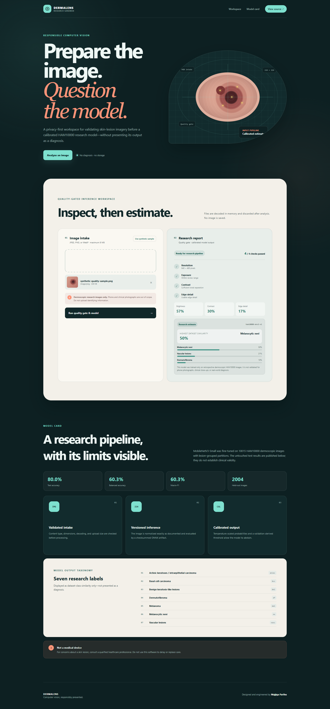
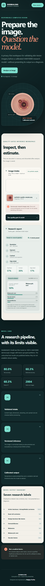

# Dermalens - Responsible skin-lesion ML research

A privacy-first Flask application that quality-checks dermoscopic images and
runs a calibrated, abstention-aware HAM10000 research classifier through ONNX
Runtime.

[](https://github.com/Parthu-M/Skin_Cancer_Prediction/actions/workflows/ci.yml)
[](https://www.python.org/)
[](LICENSE)
[](models/MODEL-LICENSE.md)

> **Not a medical device.** This non-commercial research demonstration does
> not provide a diagnosis or medical advice. Do not use it for screening,
> triage, treatment, or decisions about seeking care.

## Live application

**[Open the verified Dermalens deployment](https://parthu-dermalens.onrender.com)**

The Render service deploys from `main` in the Singapore region. Its health
endpoint, synthetic workflow, responsive layouts, and real ONNX inference were
verified after the production release on July 27, 2026.

[](https://render.com/deploy?repo=https%3A%2F%2Fgithub.com%2FParthu-M%2FSkin_Cancer_Prediction)

## Product preview

The interface includes a browser-generated synthetic sample, allowing the
workflow to be demonstrated without shipping or hotlinking patient imagery.



<details>
<summary>Mobile layout</summary>



</details>

## What it demonstrates

- A polished responsive interface with drag-and-drop upload and accessible
  report states
- Safe in-memory JPEG, PNG, and WebP decoding with size, dimension, and
  decompression-bomb limits
- Resolution, exposure, contrast, and edge-detail quality gates
- A versioned MobileNetV3-Small ONNX model with SHA-256 integrity verification
- Lesion-grouped train, validation, and held-out test partitions
- Temperature-calibrated probabilities and validation-derived abstention
- Transparent performance evidence instead of an unsupported accuracy claim
- Flask application factory, centralized errors, structured logging, and
  security-focused response headers
- Pytest coverage, Ruff linting, dependency auditing, Docker, Render Blueprint,
  and GitHub Actions CI

## Measured model results

The model was fine-tuned on all 10,015 HAM10000 images using partitions grouped
by `lesion_id`, preventing images of one lesion from crossing split boundaries.
The following results are from the untouched 2,004-image test partition:

| Metric | Result |
| --- | ---: |
| Accuracy | 80.04% |
| Balanced accuracy | 60.31% |
| Macro-F1 | 60.26% |
| Weighted-F1 | 80.07% |
| Expected calibration error | 3.43% |

HAM10000 is highly imbalanced, so balanced accuracy and macro-F1 are shown
beside overall accuracy. Per-class results, split hashes, calibration details,
limitations, and the confusion matrix are documented in the
[full model card](MODEL_CARD.md).

## Architecture

```text
Browser
  |
  | multipart image
  v
Flask API
  |-- content and filename validation
  |-- in-memory Pillow decode
  |-- quality gate
  |     `-- fail: return quality report without inference
  `-- pass
        |-- deterministic preprocessing
        |-- checksummed ONNX Runtime inference
        |-- temperature scaling
        `-- confidence-aware result or abstention
```

```text
.
|-- app.py                    # Flask factory, routes, errors, security headers
|-- image_analysis.py         # bounded decoding and quality measurements
|-- model_runtime.py          # model integrity, preprocessing, ONNX inference
|-- ml/
|   |-- train.py              # grouped training, evaluation, calibration, export
|   |-- dataset_manifest.json # verified dataset provenance
|   `-- README.md             # reproducible dataset and training instructions
|-- models/
|   |-- model-config.json     # version, checksum, preprocessing, model card data
|   |-- metrics.json          # aggregate metrics, split hashes, training history
|   `-- *.onnx                # deployable 6.11 MB classifier
|-- static/                   # responsive interface
|-- templates/                # semantic server-rendered views
|-- tests/                    # routes, validation, safety, and real model runtime
|-- Dockerfile
|-- gunicorn.conf.py
`-- render.yaml
```

## Technology stack

| Area | Technology |
| --- | --- |
| UI | Semantic HTML, modern CSS, vanilla JavaScript |
| API | Python 3.12, Flask, Gunicorn |
| Image processing | Pillow, NumPy |
| ML runtime | ONNX Runtime CPU |
| Training | PyTorch, TorchVision, scikit-learn |
| Testing and quality | Pytest, coverage.py, Ruff, pip-audit |
| Delivery | Docker, Render Blueprint, GitHub Actions |

## API

### `GET /health`

Returns `200` only when the model artifact is present, its checksum matches, and
ONNX Runtime can load it.

```json
{
  "inference_enabled": true,
  "model_version": "ham10000-mnv3-v1",
  "service": "dermalens",
  "status": "healthy"
}
```

### `GET /api/model-card`

Returns the deployed model version, intended use, test metrics, dataset
provenance, taxonomy, and limitations.

### `POST /api/analyze`

Accepts multipart form data with an `image` field. A successful response
contains:

- decoded file metadata and quality measurements;
- four explainable quality-check results;
- a quality-gate status;
- either three ranked calibrated probabilities, a low-confidence abstention,
  or an explanation that inference was skipped; and
- an explicit research-only disclaimer.

Uploads are processed in memory and are not saved.

## Local development

Python 3.12 is recommended.

```powershell
git clone https://github.com/Parthu-M/Skin_Cancer_Prediction.git
cd Skin_Cancer_Prediction
python -m venv .venv
.\.venv\Scripts\Activate.ps1
python -m pip install --upgrade pip
pip install -r requirements-dev.txt
python app.py
```

Open <http://127.0.0.1:5000>.

### Environment variables

No secrets are required. Safe defaults are listed in [`.env.example`](.env.example).

| Variable | Purpose | Default |
| --- | --- | --- |
| `HOST` | Development bind address | `127.0.0.1` |
| `PORT` | HTTP port | `5000` |
| `LOG_LEVEL` | Application log level | `INFO` |
| `WEB_CONCURRENCY` | Gunicorn process count | `1` |
| `WEB_THREADS` | Threads per Gunicorn worker | `4` |
| `ONNX_INTRA_OP_THREADS` | ONNX CPU thread limit | `2` |
| `MODEL_PATH` | Versioned ONNX artifact | `models/dermalens-ham10000-mobilenetv3.onnx` |
| `MODEL_CONFIG_PATH` | Model checksum and card data | `models/model-config.json` |

## Validation

```powershell
ruff check .
pytest --cov --cov-report=term-missing
python -m compileall -q app.py image_analysis.py model_runtime.py ml
pip-audit -r requirements.txt
docker build -t dermalens .
```

The test suite includes a real-artifact integration test that verifies the
committed SHA-256, loads the ONNX model, and executes inference.

## Reproduce model training

Training data is intentionally excluded from Git. Follow
[`ml/README.md`](ml/README.md) to acquire the official HAM10000 metadata and
images, create a separate PyTorch environment, train with grouped partitions,
evaluate, calibrate, and export ONNX.

The generated artifact is accepted only after CPU PyTorch-to-ONNX parity passes
with a maximum absolute logit difference no greater than `1e-4`.

## Deployment

### Docker

```powershell
docker build -t dermalens .
docker run --rm -p 10000:10000 dermalens
curl http://127.0.0.1:10000/health
```

The container runs as a non-root user with one Gunicorn process to avoid
duplicating the model in memory.

### Render

The production service is available at
<https://parthu-dermalens.onrender.com>. [`render.yaml`](render.yaml) provides
the reproducible Blueprint definition, including the health check, runtime
version, start command, and resource-safe inference settings.

No API key, database, or secret environment variable is required.

## Engineering decisions

**Preventing leakage.** HAM10000 contains multiple images of some lesions.
Random image splitting can place the same lesion in training and test data, so
the pipeline groups every partition by lesion ID.

**Handling imbalance.** The training loss uses inverse-square-root class
weights, while evaluation reports balanced accuracy, macro-F1, and per-class
support alongside overall accuracy.

**Failing safely.** Missing or altered model artifacts make `/health` return
`503`. Low-quality images skip inference, and low-confidence results abstain.

**Keeping claims honest.** The previous unreproducible 97% claim was removed.
Only results generated by the versioned pipeline and untouched test split are
published.

## Security and privacy

- Images never leave process memory and API responses use `Cache-Control: no-store`.
- Upload bytes, decoded formats, dimensions, MIME types, and filenames are
  validated before inference.
- Content Security Policy, frame protection, MIME sniffing protection, a
  restrictive Permissions Policy, and no-referrer policy are enabled.
- Production errors are generic; details remain in structured server logs.
- Model paths and runtime configuration use environment variables; no secret or
  `.env` file is committed.

Security concerns can be reported using [`SECURITY.md`](SECURITY.md).

## Future improvements

- Evaluate on an external dermoscopy dataset with compatible licensing
- Quantify uncertainty with repeated seeds and confidence intervals
- Add explicit out-of-distribution detection beyond quality and confidence gates
- Expand subgroup analysis only with sufficiently supported, appropriate data
- Replace the legacy ONNX exporter after validating numerical parity

## Author

**Majjiga Parthu** - M.Tech Computer Science and Engineering

[GitHub](https://github.com/Parthu-M) ·
[Portfolio](https://parthu-m.github.io/Portfolio/) ·
[LinkedIn](https://www.linkedin.com/in/majjigaparthu/)

## Licences

The application source is available under the [MIT License](LICENSE).
HAM10000 and the derived model artifact are separately governed by
[CC BY-NC 4.0](models/MODEL-LICENSE.md).
